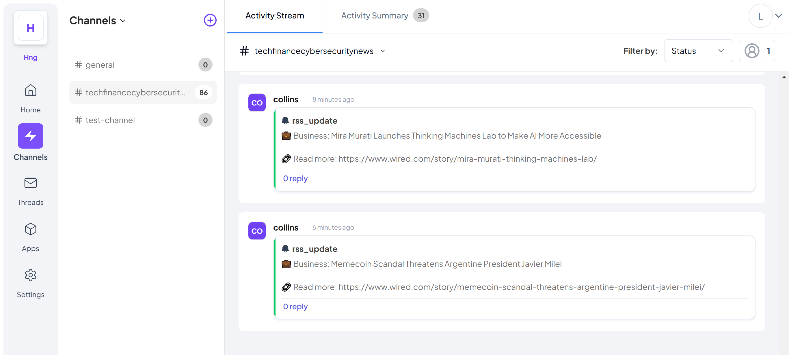
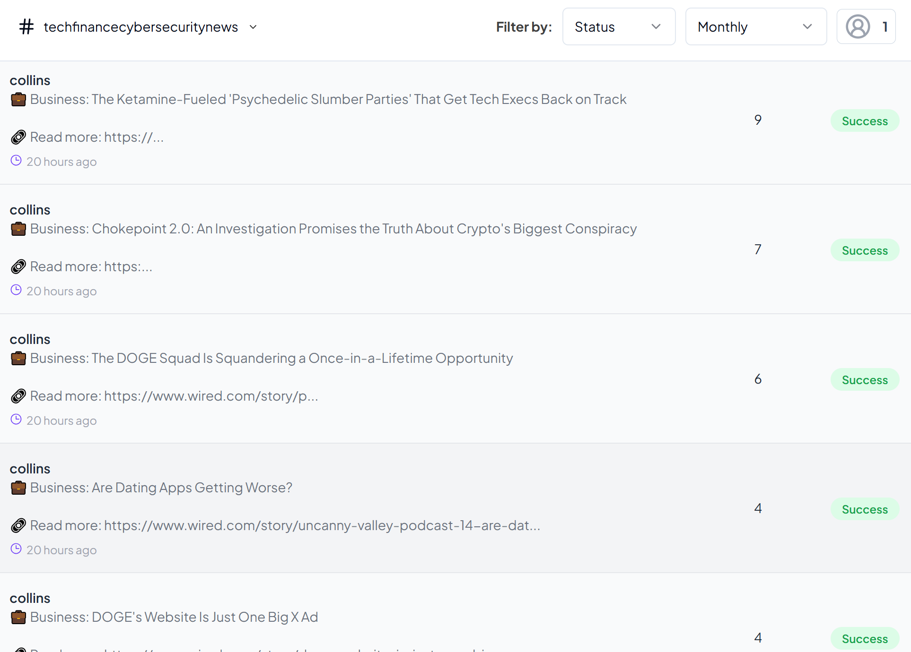

# Telex RSS Feed Integration

A Node.js integration that fetches RSS feeds from tech news sources and posts updates to a Telex channel via webhooks.

## Features

- Fetches RSS feeds from multiple sources:
    - TechCrunch (Technology News)
    - Wired (Business News)
    - Krebs on Security (Cybersecurity)
- Posts formatted updates to Telex channels via webhooks
- Runs on configurable intervals using cron syntax
- Includes error handling and retry mechanisms
- Prevents duplicate posts

## Setup

1. Clone the repository:
```bash
git clone https://github.com/telexintegrations/telex-integration-rss-feed-to-telex-channel.git
cd telex-integration-rss-feed-to-telex-channel
```

2. Install dependencies:
```bash
npm install
```

## Usage

### Running the Integration
```bash
# Development mode with auto-reload:
npm run dev
```

### Configuration
Configure the integration through `integration.json`. Key settings include:

- `interval`: Cron expression for update frequency (default: "*/30 * * * *")
- `webhookURL`: Your Telex webhook URL
- `feeds`: Array of RSS feed sources and their categories

### API Endpoints

- `POST /tick`: Manually trigger feed fetching
- `GET /integration.json`: Get integration specifications

## Deployment on Render

1. Create a new Web Service on Render
2. Connect your GitHub repository
3. Configure the service:
   - Build Command: `npm install`
   - Start Command: `npm start`
   - Environment Variables:
     - `NODE_ENV`: production
     - `WEBHOOK_URL`: Your Telex webhook URL

## Screenshots
<div align="center">
    
    
</div>

## Contributing

1. Fork the repository
2. Create your feature branch
3. Commit your changes
4. Push to the branch
5. Create a Pull Request

## License

MIT License

## Author

Collins Lekakeny ([@lekakenycollins8](https://github.com/lekakenycollins8))